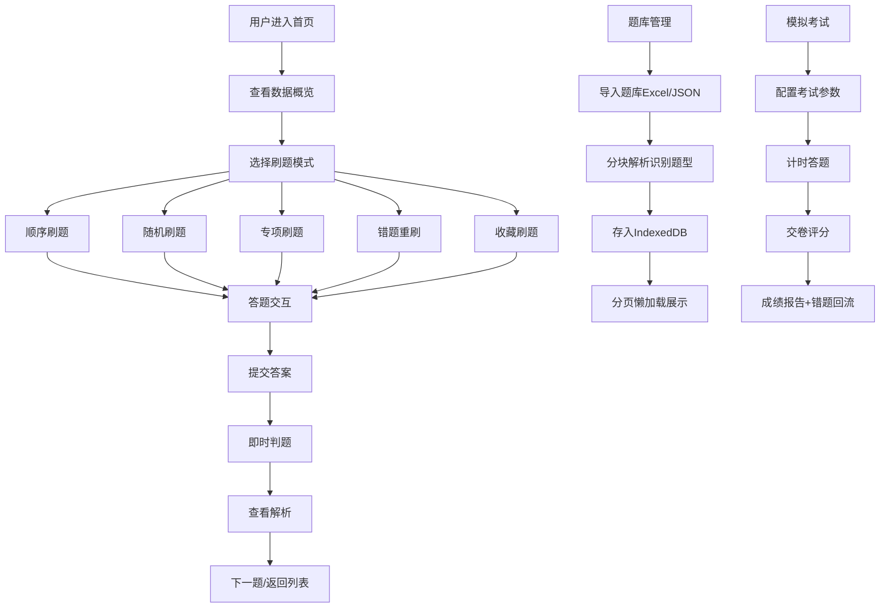

## 1. 产品概述
IT刷题网页应用，为程序员和IT学习者提供全功能的本地刷题平台，支持海量题库存储与多种刷题模式，无需服务器即可离线使用。
- 核心目标：打造一款功能完备、体验流畅的IT刷题工具，覆盖从题库管理到刷题练习、考试模拟的全流程
- 目标用户：程序员、IT从业者、计算机专业学生、面试备考者

## 2. 核心功能

### 2.1 用户角色
| 角色 | 注册方式 | 核心权限 |
|------|----------|----------|
| 普通用户 | 无需注册，本地使用 | 全部功能，本地数据存储 |

### 2.2 功能模块
1. **首页**：数据概览、快速开始、刷题模式入口
2. **刷题页**：顺序/随机/专项/错题/收藏五种模式、即时判题、详细解析
3. **考试页**：模拟考试、计时答题、自动交卷、成绩分析
4. **题库管理**：批量导入（Excel/JSON）、导出备份、标签分类、全文检索
5. **错题本**：错题自动收录、筛选重刷、错题统计
6. **收藏夹**：题目收藏、分类管理
7. **数据统计**：刷题数据可视化、每日打卡、学习趋势
8. **设置页**：明暗主题、字体调节、快捷键配置

### 2.3 页面详情
| 页面名称 | 模块名称 | 功能描述 |
|----------|----------|----------|
| 首页 | 数据概览卡片 | 总题数、已刷题数、正确率、连续打卡天数 |
| 首页 | 快速开始区 | 继续上次、随机刷题、专项练习快捷入口 |
| 首页 | 刷题模式卡片 | 顺序/随机/专项/错题/收藏五种模式入口 |
| 刷题页 | 题目展示区 | 题干、选项/编辑器、答题进度 |
| 刷题页 | 操作控制区 | 上一题、下一题、提交、收藏、标记 |
| 刷题页 | 解析展示区 | 正确答案、详细解析、知识点标签 |
| 刷题页 | 背题模式 | 直接显示答案与解析，快速记忆 |
| 考试页 | 考试配置 | 选题范围、题量、时长、题型分布 |
| 考试页 | 答题界面 | 计时、答题卡、题目导航 |
| 考试页 | 成绩报告 | 得分、正确率、错题回顾、用时统计 |
| 题库管理 | 导入功能 | Excel/JSON批量导入、分块解析、进度显示 |
| 题库管理 | 题库列表 | 分页懒加载、分类筛选、搜索 |
| 题库管理 | 标签管理 | 标签增删改查、题目标签关联 |
| 错题本 | 错题列表 | 按时间/章节/题型筛选、重刷入口 |
| 收藏夹 | 收藏列表 | 收藏题目管理、分类浏览 |
| 数据统计 | 总览图表 | 刷题量趋势、正确率曲线、题型分布 |
| 数据统计 | 打卡日历 | 每日打卡记录、连续打卡统计 |
| 数据统计 | 个人笔记 | 题目笔记、学习心得 |
| 设置页 | 外观设置 | 明暗主题切换、字体大小调节 |
| 设置页 | 快捷键 | 常用操作快捷键配置与说明 |
| 设置页 | 数据管理 | 数据备份、恢复、清空 |

## 3. 核心流程

## 4. 用户界面设计

### 4.1 设计风格
- **主色调**：科技蓝 (#3B82F6)，搭配深靛蓝 (#1E40AF) 作为强调色
- **辅助色**：成功绿 (#10B981)、错误红 (#EF4444)、警告橙 (#F59E0B)
- **中性色**：采用 zinc 色系，从 50 到 950 构建完整灰度体系
- **按钮风格**：圆角按钮 (rounded-lg)，带微妙悬停阴影效果
- **字体**：主字体使用现代无衬线字体，代码使用等宽字体
- **布局风格**：卡片式布局，清晰的信息层级，充足留白
- **图标风格**：线性图标 (lucide-vue-next)，简洁现代

### 4.2 页面设计概览
| 页面名称 | 模块名称 | UI元素 |
|----------|----------|--------|
| 首页 | 数据概览 | 渐变卡片、图标、统计数字、趋势箭头 |
| 首页 | 模式选择 | 图标卡片网格、hover缩放动效 |
| 刷题页 | 题目卡片 | 白色卡片、阴影、进度条、选项按钮组 |
| 刷题页 | 解析区 | 折叠面板、代码高亮、标签组 |
| 考试页 | 答题卡 | 网格按钮、状态颜色区分、进度环 |
| 题库管理 | 导入区域 | 拖拽上传区、进度条、状态提示 |
| 数据统计 | 图表区 | 柱状图、折线图、饼图、日历热力图 |

### 4.3 响应式
- 桌面端 (>=1024px)：侧边导航 + 主内容区，多列布局
- 平板端 (768px-1023px)：顶部导航 + 主内容区，两列布局
- 移动端 (<768px)：底部Tab导航 + 单列布局，触摸优化

### 4.4 动效设计
- 页面切换：平滑淡入淡出
- 答题反馈：正确/错误的颜色动效
- 按钮悬停：背景色过渡 + 轻微上浮
- 数据加载：骨架屏 + pulse动画
- 滚动：平滑滚动行为
