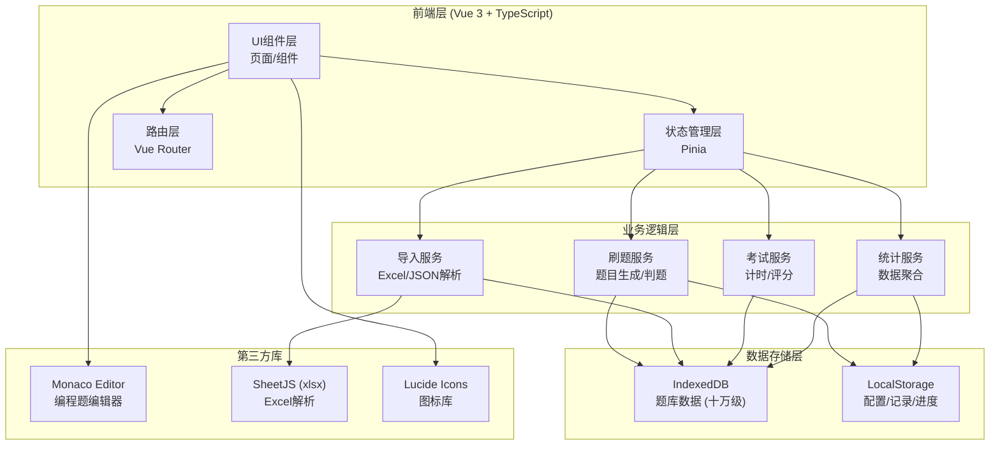
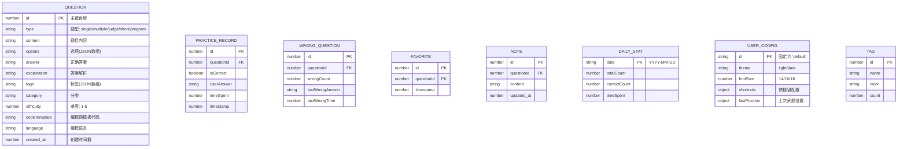

## 1. 架构设计



## 2. 技术描述

- **前端框架**：Vue 3 + TypeScript + Composition API
- **构建工具**：Vite 5
- **UI样式**：TailwindCSS 3
- **状态管理**：Pinia
- **路由**：Vue Router 4
- **图标**：lucide-vue-next
- **编程题编辑器**：@monaco-editor/volar (monaco-editor)
- **Excel解析**：xlsx (SheetJS)
- **数据库**：IndexedDB (idb封装) + LocalStorage
- **图表**：Chart.js + vue-chartjs
- **代码高亮**：highlight.js / prismjs

## 3. 路由定义

| 路由 | 页面 | 用途 |
|------|------|------|
| / | 首页 | 数据概览、快速开始、模式选择 |
| /practice | 刷题页 | 五种刷题模式、答题、解析 |
| /exam | 考试页 | 模拟考试配置、答题、成绩报告 |
| /questions | 题库管理 | 题库列表、导入导出、标签管理 |
| /wrong | 错题本 | 错题列表、筛选、重刷 |
| /favorites | 收藏夹 | 收藏题目管理 |
| /stats | 数据统计 | 图表统计、打卡日历、笔记 |
| /settings | 设置页 | 主题、字体、快捷键、数据管理 |

## 4. 数据模型

### 4.1 数据模型定义



### 4.2 IndexedDB 存储设计

**数据库名**: it_quiz_db  
**版本**: 1

| 对象仓库 | 主键 | 索引 | 用途 |
|----------|------|------|------|
| questions | id (自增) | type, category, tags(multiEntry) | 题库存储 |
| practiceRecords | id (自增) | questionId, timestamp | 答题记录 |
| wrongQuestions | questionId | wrongCount, lastWrongTime | 错题集 |
| favorites | questionId | timestamp | 收藏夹 |
| notes | questionId | updated_at | 题目笔记 |
| dailyStats | date | totalCount | 每日统计 |
| tags | id (自增) | name | 标签管理 |

### 4.3 LocalStorage 存储设计

| 键名 | 用途 |
|------|------|
| it_quiz_config | 用户配置 (主题、字体、快捷键) |
| it_quiz_last_practice | 上次刷题位置 |
| it_quiz_daily_checkin | 打卡记录 |
| it_quiz_exam_draft | 考试草稿 |

## 5. 项目目录结构

```
src/
├── components/          # 通用组件
│   ├── layout/         # 布局组件
│   │   ├── AppHeader.vue
│   │   ├── AppSidebar.vue
│   │   └── AppBottomNav.vue
│   ├── question/       # 题目相关组件
│   │   ├── QuestionCard.vue
│   │   ├── OptionList.vue
│   │   ├── CodeEditor.vue
│   │   └── ExplanationPanel.vue
│   ├── common/         # 通用UI组件
│   │   ├── StatCard.vue
│   │   ├── ProgressBar.vue
│   │   ├── EmptyState.vue
│   │   └── LoadingSpinner.vue
│   └── exam/           # 考试相关组件
│       ├── ExamConfig.vue
│       ├── AnswerSheet.vue
│       └── ExamResult.vue
├── pages/              # 页面组件
│   ├── Home.vue
│   ├── Practice.vue
│   ├── Exam.vue
│   ├── Questions.vue
│   ├── WrongBook.vue
│   ├── Favorites.vue
│   ├── Statistics.vue
│   └── Settings.vue
├── stores/             # Pinia状态管理
│   ├── question.ts     # 题库状态
│   ├── practice.ts     # 刷题状态
│   ├── exam.ts         # 考试状态
│   ├── stats.ts        # 统计状态
│   └── settings.ts     # 设置状态
├── composables/        # 组合式函数
│   ├── useIndexedDB.ts # IndexedDB封装
│   ├── usePractice.ts  # 刷题逻辑
│   ├── useImport.ts    # 导入逻辑
│   └── useShortcuts.ts # 快捷键
├── utils/              # 工具函数
│   ├── questionParser.ts # 题目解析
│   ├── excelParser.ts  # Excel解析
│   ├── storage.ts      # 存储工具
│   └── format.ts       # 格式化工具
├── types/              # TypeScript类型
│   └── index.ts
├── router/             # 路由配置
│   └── index.ts
├── App.vue
└── main.ts
```

## 6. 核心技术方案

### 6.1 海量题库性能优化
- **分页懒加载**：使用 IndexedDB 游标 + 分页查询，每次加载 50 条
- **分块导入**：Excel/JSON 导入时分 100 条/块 异步插入，避免阻塞主线程
- **虚拟滚动**：题库列表使用虚拟滚动，仅渲染可视区域
- **索引优化**：为 type、category、tags 建立索引，加速查询

### 6.2 五种题型识别
- **单选题**：含 A/B/C/D 选项，唯一正确答案
- **多选题**：多选项，多个正确答案
- **判断题**：正确/错误 两个选项
- **简答题**：文本输入，参考答案对比
- **编程题**：代码编辑器，支持多语言，模板预设

### 6.3 五种刷题模式
- **顺序刷题**：按题库顺序依次出题
- **随机刷题**：从全题库随机抽取
- **专项刷题**：按分类/标签/难度筛选
- **错题重刷**：从错题本中出题
- **收藏刷题**：从收藏夹中出题

### 6.4 快捷键支持
- `←` / `A`：上一题
- `→` / `D`：下一题
- `1-4` / `A-D`：选择选项
- `Enter`：提交答案
- `Space`：显示/隐藏解析
- `F`：收藏/取消收藏
- `M`：背题模式切换
